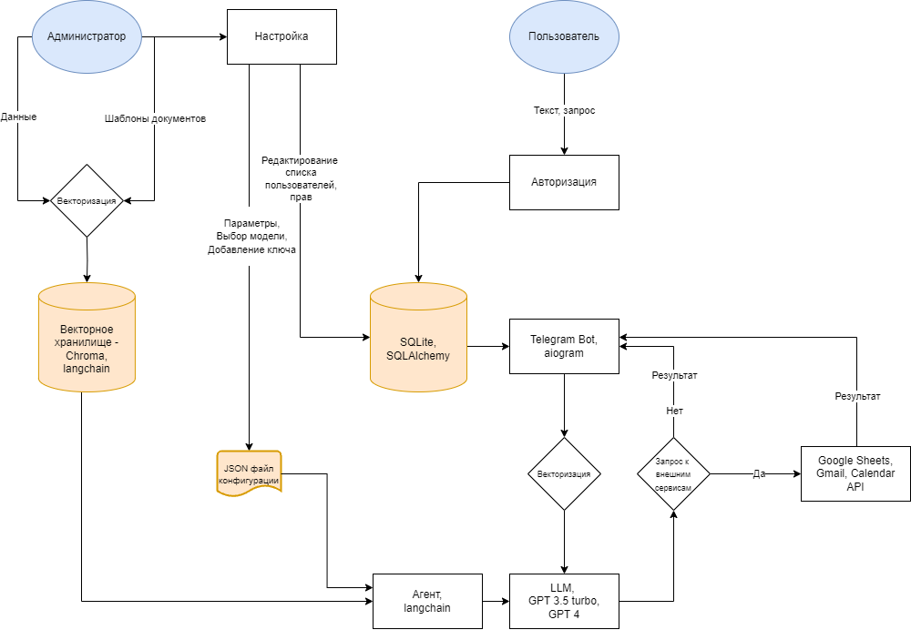

# agent-telegram-bot

## **1. Цель и предпосылки**

### 1.1 Общая информация

**Целью** внедрения данного проекта является упрощение и оптимизация рабочих процессов в различных сферах бизнеса (розничная торговля, корпоративные услуги, управление задачами) с помощью AI-ассистента на базе агентов больших языковых моделей, который будет выполнять различные рабочие задачи.

Таким образом, ключевая задача - разработка универсального AI-помощника, способного выполнять функции чат-бота и автоматизированного ассистента с помощью LLM.

Во время пилотного проекта мы будем отслеживать нагрузку на модели и опрашивать клиентов для улучшения работы ассистента.

### 1.2 **Почему станет лучше, чем сейчас, от использования ML**

Сотрудники компании тратят значительную часть рабочего времени на выполнение однотипных и рутинных задач, из-за чего снижается их мотивация и эффективность работы, а значит и вклад, который они вносят в бизнес-процессы компании.

AI-ассистент возьмет на себя многие рутинные задачи и позволит сотрудникам фокусироваться на действительно важных вещах, а также позволит в значительной степени автоматизировать рабочий процесс.

### **1.3 Почему это актуально**

Рынок автономных систем (агентов) ИИ будет расти в среднем на 43% (с 5 млрд долларов в 2023 г. до 29 млрд долларов к 2028 г.) — [Ссылка](https://review.insignia.vc/2023/08/23/autonomous-ai-agents/)

Объем рынка больших языковых моделей (LLM) вырастет на 40,8 млрд долларов США к 2029 г. при среднегодовом темпе роста 21,4% — [Ссылка](https://finance.yahoo.com/news/large-language-model-llm-market-151500260.html?guccounter=1)

67% компаний считают приоритетом внедрение генеративных ИИ моделей типа GPT в 2023 г. — [Ссылка](https://ai-infrastructure.org/enterprise-generative-ai-adoption-report-aug-2023/)

По данным Juniper Research в 2023 году чат-боты будут ежегодно экономить ритейлерам 439 млн против 7 млн в 2019 году. — [Ссылка](https://www.juniperresearch.com/press/chatbot-interactions-retail-reach-22-billion-2023)

Популярность ботов растет при их интеграции с мессенджерами — привычной средой для клиентов. — [Ссылка](https://www.tadviser.ru/index.php/%D0%A1%D1%82%D0%B0%D1%82%D1%8C%D1%8F:%D0%A7%D0%B0%D1%82-%D0%B1%D0%BE%D1%82%D1%8B_%28Chat-bot%29_%D0%92%D0%B8%D1%80%D1%82%D1%83%D0%B0%D0%BB%D1%8C%D0%BD%D1%8B%D0%B5_%D1%81%D0%BE%D0%B1%D0%B5%D1%81%D0%B5%D0%B4%D0%BD%D0%B8%D0%BA%D0%B8)

Accenture: задачи с более высоким потенциалом автоматизации могут
быть преобразованы LLM с меньшим участием человека. — [Ссылка](https://www.accenture.com/content/dam/accenture/final/accenture-com/document/Accenture-A-New-Era-of-Generative-AI-for-Everyone.pdf)

### **1.4 Стоимость**

**Издержки для поддержания инфраструктуры проекта**

Зарплаты и прочие расходы, связанные с наймом и содержанием команды инженеров, занимающихся поддержкой и обслуживанием модели и окружения.

**Затраты на инфраструктуру проекта**

Затраты на вычислительные ресурсы (например, серверы или облачные вычисления), хранение данных, сетевую инфраструктуру, обеспечение безопасности. Инфраструктура ML-моделей может быть дорогостоящей и требовать постоянной поддержки и обновлений, особенно при обработке больших объемов данных или в условиях высоких требований к производительности и доступности системы.

Если затраты на создание MVP системы превысят издержки от потери производительности отдельных сотрудников за `N` месяцев после запуска MVP, то стоит поставить вопрос о целесообразности продолжения исследовательской работы в данном направлении.

**Основные каналы расходов на инфраструктуру (с расчетом на 10-25 пользователей):**

Аренда сервера: ~ 4 500 - 12 000 рублей.

## 2. Бизнес-требования (постановка бизнес-задач)

### 2.1 Краткое описание бизнес-требований

Проект направлен на повышение эффективности работы сотрудников путем внедрения AI-ассистента, который автоматизирует некоторые процессы в компании.

Бизнес-требования включают создание ассистента, задачами которого будет получение точных ответов на запросы по внутренним документам (как подать заявление на отпуск, как можно подключиться к занятиям по английскому), автоматическое заполнение и создание документов по шаблону (договора, заявления на отпуск, NDA), добавление встреч на основе свободных слотов сотрудников, работа с сервисами Google, Yandex, Notion, Slack и др.

### 2.2 Бизнес-ограничения

- Стоимость: издержки на создание и поддержание инфраструктуры сервиса
- Ограничения на передачу конфиденциальных данных

### 2.3 Критерии успеха

**Экономия времени и уменьшение цикла обработки задач (Cycle Time Reduction)**: Боты, автоматизирующие рутинные задачи, позволяют ускорить выполнение задач, что приводит к уменьшению времени, необходимого для завершения рабочих процессов. Уменьшение цикла обработки задач может быть измерено в часах, днях или даже неделях, что в конечном итоге увеличивает оперативность бизнес-процессов.

**Увеличение производительности сотрудников (Employee Productivity)**: Автоматизация рутинных задач позволяет сотрудникам освободить время для выполнения более стратегических и креативных задач. Это улучшает общую производительность персонала и может быть измерено в повышении объема работы, выполняемой за определенное время.

**Улучшенная точность и минимизация ошибок (Error Rate Reduction)**: Боты могут помочь уменьшить вероятность ошибок, связанных с человеческим фактором, что может существенно повысить качество работы и уровень обслуживания. Это измеряется в процентном соотношении ошибок до и после внедрения бота.

**Экономия затрат (Cost Savings)**: Автоматизация рутины позволяет сократить операционные расходы, так как боты могут заменить повторяющиеся и трудозатратные процессы, требующие участия персонала. Экономия затрат измеряется в денежном выражении, показывая уменьшение расходов на определенные операции или процессы.

**Улучшенный опыт клиента (Customer Experience)**: Боты могут обеспечить более быстрое, точное и круглосуточное обслуживание сотрудников, что приводит к улучшению их удовлетворенности компанией. Это можно измерить через опросы удовлетворенности сотрудников, которые, кстати, можно проводить прямо в боте.

**Увеличение объема обработанных запросов (Request Volume Handling)**: Автоматизированные боты могут обрабатывать больший объем запросов от клиентов или сотрудников в сравнении с ручной обработкой. Эффективная обработка большего объема запросов является показателем эффективности бота.

## 3. Постановка технической задачи

Задача генерации текста с использованием LLM и подключением агентов для решения комплексных задач.

### 3.1 Постановка технической задачи на основе бизнес-требований

Разработка решения на основе ChatGPT API с применением агентов LLM для ускорения и упрощения решения бизнес-задач (см. Бизнес-требования).

Используя Chroma, векторизуем текст для ретривера базы знаний, определим путь для хранения шаблонов документов, а также добавим функцио для интеграции с сервисами Google, Notion, Slack

### 3.2 Метрики качества решения и критерий успеха на основе этих метрик

Данные для расчета берутся из базы данных, в которой содержится информация о пользователях, запросах, ответов модели, времени, статусов запросов/ответов, реакцией (фидбека) пользователей и др.

**Accuracy of Responses**

- Точность ответов можно оценить, сравнивая предоставленные ответы с эталонными ответами. Это может быть процент правильных ответов от общего числа запросов

- Целевой показатель: 95%

- Связь с бизнес-метриками: точность ответов позволяет уменьшить показатель Error Rate Reduction, который зачастую встречается при ручном заполнении документов
  
  $$
   Accuracy \ of \ Responses = \frac{Number\ of\ correct\ answers}{Total\ number\ of\ requests} ×100
   $$
  
  *Пояснение по формуле: количество правильных ответов рассчитывается на основе ручного тестирования, сравнивая ответы модели с эталонными.*

**Response Time**

- Время отклика на запросы рассчитываем, измеряя интервал времени между моментом запроса и моментом получения ответа
- Целевой показатель: 5 секунд
- Связь с бизнес-метриками: метрикой с временем отклика мы экономим время (Cycle Time Reduction), имеем возможность увеличивать объемы обработанных запросов (Request Volume Handling) и в целом повышаем эффективность сотрудников (Employee Productivity) за счет автоматизации процессов, сокращая издержки (Cost Savings)

$$
Response\ time = Bot\ response\ time - User \ request\ time
$$

**System Reliability**

- Оцениваем System Reliability через метрику безотказной работы (Mean Time Between Failures)

- Целевой показатель: 168 часов

- Связь с бизнес-метриками: чем более надежная система, тем меньше финансовых издержек на ее обслуживание — это позволяет сократить общие издержки (Cost Savings)
  
  $$
   System\ Reliability = \frac{Total\ work\ time}{Number\ of\ failures}
   $$

**Consistency of Responses**

- Оценка согласованности ответов на повторяющиеся или схожие запросы

- Целевой показатель: 95%

- Связь с бизнес-метриками: оценивает эффективность системы при повторяющихся задачах, способствует уменьшению Error Rate Reduction
  
  $$
   Consistency\ of\ Responses = \frac{Similar\ answers}{Total\ number\ of\ similar\ requests} ×100
  $$

*Пояснение по формуле: количество похожих ответов рассчитывается на основе ручного тестирования.*

**Quality of responses**

- В рамках метрики оценки качества ответов планируется считать долю ответов с негативной реакцией к общему числу запросов
- Целевой показатель: <5%
- Связь с бизнес-метриками: более качественные и хорошие ответы модели позволяют в большей степени переложить рабочие задачи с сотрудников на модель, увеличивая метрику Customer Experience

$$
Quality\ of\ responses = \frac{Number\ negative\ reactions}{Total\ number\ of\ requests} ×100
$$

### 3.4 Этапы решения задачи

1 этап: Выбор и описание метрик

2 этап: Выбор LLM

- Обоснование выбора OpenAI API
  
  Мощность. Предоставляет доступ к самой мощной LLM на рынке.
  
  Адаптируемость к различным задачам: GPT может быть настроен для выполнения разнообразных задач, от простого ответа на вопросы до выполнения более сложных операций, таких как автоматизация задач и интеграция с другими сервисами. Также имеется удобное взаимодействие через фреймворк langchain.
  
  Масштабируемость: API ChatGPT легко масштабируется для обработки большого количества запросов, что важно для растущих команд и организаций.
  
  Экономическая выгода. ****API является выгодным решением для использования на постоянной основе. Также позволяет не обслуживать собственные сервера с GPU для инференса модели.
  
  Сокращение затрат на разработку: Использование готового API для обработки естественного языка уменьшает время и ресурсы, необходимые для разработки собственных решений с нуля.

- Использование Open source LLM
  
  Использование open source LLM (таких как LLama 2, Mistral) позволят преодолеть проблему зависимости от API ChatGPT и трансграничной передачи персональных данных, так как некоторые организации заинтересованы в повышенном уровне конфиденциальности данных и не готовы использовать LLM через API.

3 этап: Проектирование архитектуры сервиса

Учитывая требования и ограничения, выбрать векторное хранилище для информации об организации.

Настроить взаимодействие базы данных, сторонних сервисов и LLM.

Интерфейс реализовать в виде web приложения, как наиболее мобильного и удобного инструмента для небольших команд.

4 этап: Сбор и подготовка данных

Каждая организация-партнер предоставляет свою уникальную базу знаний и набор шаблонов документов. Данные могут включать текстовые документы (.txt, .docx, .md), таблицы(.csv, .xlsx), PDF-файлы, которые должны быть векторизованы и сохранены в векторном хранилище.

Дополнительно будут сохранены и векторизованы API сервисов, с которыми будет взаимодействовать LLM.

5 этап: Настройка и интеграция агента LLM

Добавление данных/инструментов из внешней среды, к которым даем доступ нашему агенту. Таким образом, мы интегрируем различные сервисы к LLM.

Для интеграции и настройки агента, необходимо прописать функции взаимодействия с внешними сервисами (Googlе Календарем, Notion, Slack, шаблонами документов).

После написания отдельных модулей с взаимодействием мы добавляем данные функции к агенту LLM посредством фреймворка Langchain.

Для нормальной работы агента в качестве LLM необходимо использовать модели не ниже GPT-3.5 на 16k токенов.

6 этап: Тестирование

### 3.5 **Описание данных, которые применяются для решения задачи**

Для полной реализации функционала сервиса пользователь подгружает данные для ретривера с целью последующих ответов на вопросы, а также шаблоны документов microsoft word.

Файл для ретривера на первых этапах должен иметь расширение .md, содержать неболее 13 тысяч слов, а также весить не более 300 кб. В файле можно изложить информацию, к которой могут обращаться отдельные члены команды (это могут быть регламенты организации, контакты, наиболее частые Q&A и так далее). Доступ к данным происходит посредством текстового запроса от пользователя (в свободной форме), у которого есть доступ к данному инструменту (доступ устанавливает администратор).

Посредством фреймворка Langchain данные для ретривера делятся на небольшие части, после чего векторизуются. Затем подгружаются в векторное хранилище Chroma.

Файлы с шаблонами документов подгружаются в формате (.docx) уже с разметкой в тех местах, которые предполагаются к замене - используется следующая форма записи: {{ name_variable }}. Также дается название документа. Максимальное количество документов - 5.

Название переменных внутри тела документов должны отражать суть содержащейся в ней информации (например, имя сотрудника следует представить как employee_name, а не variable_1). Название переменных пишется исключительно на английском языке.

Для того чтобы получить готовый документ, при запросе к модели необходимо представить необходимую для ответа информацию или уточнить у модели, какая информация ей необходима. В случае, если ваш документ (заявление на отпуск) содержит несколько переменных (имя сотрудника, дата начала отпуска и его продолжительность, следует в запросе отметить действие, имя сотрудника, дату начала отпуска и его продолжительность. Например, “Нужно заявление на отпуск для Иванова Ивана с 1 января на 7 дней” - после этого модель выведет заполненный шаблон документа.

Использование API для Google, Slack, Notion подразумевают использование данных пользователей на данных площадках.

## 4. Продуктивизация проекта

### 4.1 Техническая архитектура

### 4.5 Нагрузочное тестирование

1. **Пропускная способность**: оценка количества запросов в секунду, которые может обработать LLM. Включает в себя время генерации ответа и доставки его пользователю.
   - Максимальная пропускная способность: 4 запросов/сек.
   - Среднее время обработки запроса: 3 сек.
2. **Отзывчивость сервиса**: оценка времени между отправкой запроса пользователем и получением ответа. Включает в себя задержку сети и время обработки сервером.
   - Среднее время отклика бота: 5-10 сек.
   - Максимальное время отклика: 15-30 сек. (в зависимости от задачи)
3. **Масштабируемость**: тестирование сервиса на способность справляться с увеличивающимся количеством одновременных пользователей.
   - Стабильная работа до 10 одновременных пользователей
   - При 20 пользователей наблюдается замедление ответов
4. **Стабильность и надежность**: оценка способности системы работать без сбоев и ошибок при высоких нагрузках.
   - Без сбоев до 10 одновременных пользователей
   - При 20 пользователях наблюдаются периодические сбои
5. **Ресурсоемкость**: измерение использования памяти, CPU и других ресурсов сервера при различных уровнях нагрузки.
   - Использование CPU: до 80% при пиковой нагрузке
   - Использование памяти: стабильно до 70% от общего объема

### 4.6 План работ по **улучшению производительности (масштабирование)**

1. **Оптимизация кода и алгоритмов**: пересмотреть алгоритмы обработки запросов для уменьшения времени ответа.
2. **Масштабирование инфраструктуры**: использование дополнительных серверов или переход на более мощные серверы.
3. **Кэширование**: кэширование часто запрашиваемых данных для снижения нагрузки на сервер.
4. **Балансировка нагрузки**: распределение трафика между несколькими серверами.
5. **Мониторинг**: настройка системы мониторинга для своевременного обнаружения и устранения проблем.
6. **Базы данных:** база данных SQLite может стать узким местом при масштабировании, так как она не предназначена для высоких нагрузок. Рассмотрение перехода на более мощные решения, такие как PostgreSQL, может потребоваться при увеличении количества пользователей.
7. **Внешние API: з**ависимость от внешнего API может стать критической, если сервис станет недоступен или возникнут ограничения по использованию. Для минимизации рисков необходимо рассмотреть варианты использования других сильных моделей (Claude), прокси или собственных LLM.

### 4.7 Расширение системы

1. Добавление инструментов. Расширение системы за счет интеграции большего количества инструментов (сервисы Яндекс, Slack и др.)
2. Дополнительные LLM. Добавление большего количества доступных LLM.
3. Разработка мобильной, десктоп и веб версий приложения.
4. API для интеграции с 1С, CRM-системами и т.д.
5. Возможность распознавания голоса для взаимодействия в чате.
